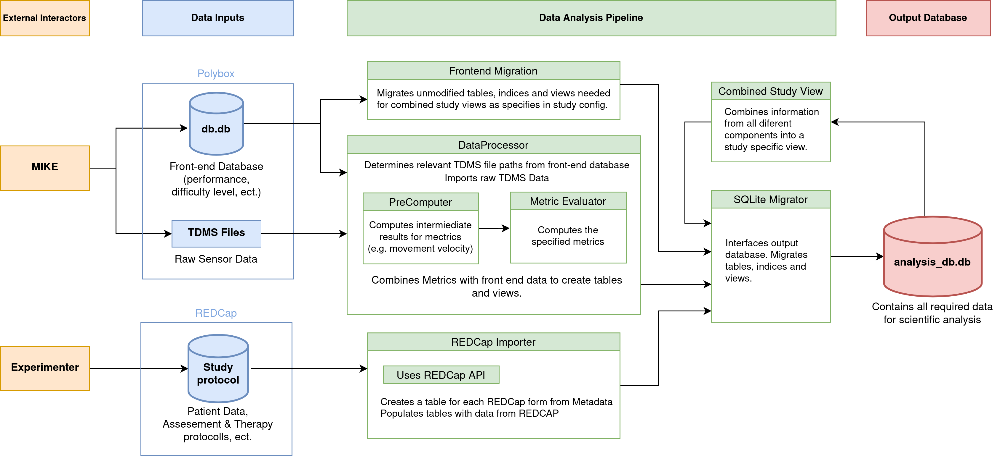

# Mike Data Analysis Pipeline

This pipeline collects all the different data from three sources and combines it into a single database suitable for analysis.

- The front-end database contains information from the mike front end code such as the displayed performance, difficulty levels, time needed, ect. This data is imported from a local file. 

- The TDMS File contains raw sensor measurements and is used to compute more accurate metrics for each exercise. This data is imported from a local file. 

- The Data from REDCap contains all information that comes from the experimenter and is fetched from REDCap via an API. 





### Setup
It is adviced to install all dependencies in a separated virtual enviroment in order to not override the system dependencies. 

### Bash Shell(Linux, MacOS, Windows Subsystem for Linux)

Install, create and activate the environment using:
```
sudo pip3 install virtualenv
python3 -m venv .venv
source .venv/bin/activate
```

Install the dependencies:
```
pip install -r requirements.txt 
```

### PyCharm on Windows

Alternatively you can also use the Graphical user interface of PyCharm. An step by step explanation can be found here: 

[Configure virtual environment in PyCharm](https://www.jetbrains.com/help/pycharm/creating-virtual-environment.html#existing-environment)


### Use the pipeline with existing study

To use the pipeline with an existing study copy simply run the main file:

```
python main.py
```

If no config file is present a new file on the top level directory is created with the name `config.py`. 
Fill in all the information specific to your machine and credentials in this file. Futhermore select a study template ba specifying a file name from `mike_analysis/study_config` like e.g. `STUDY_CONFIG = 'ksa_therapy_study'`.

### Create a new study

You can create a new study by using the template `mike_analysis/study_config/template_study`. There you can customize the behaviour of the pipeline further. Additional information on the different components of the pipeline is found in the documentation folder. 